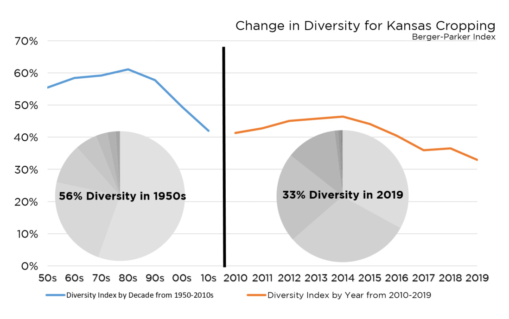

# Dryland yields of corn and sorghum as a response to precipitation in NW and SW Kansas
To study the yield response of sorghum and corn to precipitation and drought in the NW and SW Kansas crop districts.   
**Name**: Sarah Sexton-Bowser  
**Date**: May 2020  
**Project area**: Analysis of cropping trends in Kansas landscapes

## Objective
The objective is to evaluate the responsiveness of yields for corn adn 

## Outcomes
The outcomes will be two-fold. The first product will be the derived analysis of running, and fine-tuning the regression model (graphs, output anaylsis in csv, and if appropriate a map of results). The second product, will be the aligning data tools (equations, data storage and manipulation, and code) for use in future applications of exploring causal relationships between independent variables and the dependent variable of acres planted for a given crop. 

## Rationale
Knowledge of the driving determinates guiding farmer plantings presents insights to underpin strategies for investing in the advancement of mid-small range crops. Illustrated in Figure 1. is the rapid decline of diversity in cropping mix for Kansas cropping systems. This trend begs the question of what can be done to incent an increase in the diversity of the types of crops grown by farmers in Kansas. 

**Figure 1. Crop Diversity**

## Methods ##
The mathmatical approach will be a regression, most likely linear. The model will be fitted by conducting a step-wise regression, and utilization of f-tests to weigh the statistical effect of adding a particular variable.  
  
 Sorghum plantings in acres. SOURCE. USDA NASS  
 Deviation of basis price from 3 year average. SOURCE. KSU Ag Manager   
 Deviation of basis price form 3 year average of substitute. SOURCE. KSU Ag Manager  
 Ground water use SOURCE. KDA  
 Soil moisture profile or pre-season rail fall. SOURCE.KSU Mesonet  
 Use of Y exclusion for crop insurance. SOURCE. RMA, student will need to confirm accept to data  
 Random error term  
Note. The effect of variables will be evaluated for use as a predictor with subsequent fine tuning in the selection of independent variables. 

**References**  
Cobb, C.W. and Douglas, P.H., 1928. A theory of production. The American Economic Review, 18(1), pp.139-165.  
Douglas, P. H. 1967. Comments on the Cobb-Douglas production function. In The theory and empirical analysis of production (pp. 15-22). NBER.  
Hayami, Y. 1970. On the use of the Cobb-Douglas production function on the cross-country analysis of agricultural production. American Journal of Agricultural Economics, 52(2), 327-329.  
Jradi, S., Parmeter, C. F., & Ruggiero, J. (2019). Quantile estimation of the stochastic frontier model. Economics Letters, 182, 15-18. 
Patrignani, A., 2020. Pynotes. Copyright Andres Patrignani 2020 — Licensed under CC BY-NC-SA  
USDA NASS. (2019). NASS Quick Stat Database.
