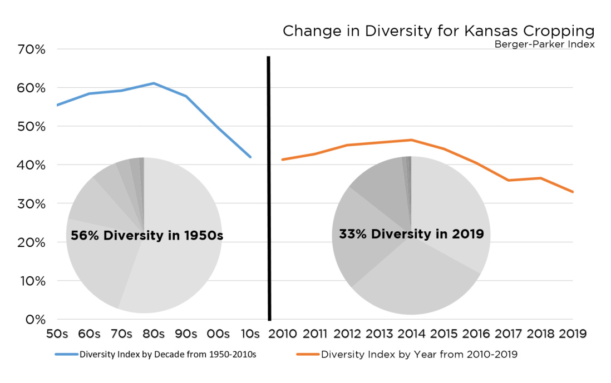

# Concept for Semester Project 
An anaylsis of the variables that influence which crop farmers will plant in the Kansas cropping system.  
**Name**: Sarah Sexton-Bowser  
**Semester**: Spring 2020  
**Project area**: Analysis of cropping trends in Kansas landscapes

## Objective
The objective is to develop a multiple regression model for use to explain the relationship between planting of sorghum, dependent variable, with independent variables which may include; relative values of crop prices, rainfall, genetic gain in crop technologies, use of irrigation, and policies for risk managment like crop insurance. The scope is sorghum plantings in the cropping system of Kansas, with aim for county level analysis. The time horizon will be determined based on availability of compatible data sources but is anticipated to span from the 1990s to today.

## Outcomes
The outcomes will be two-fold. The first product will be the derived analysis of running, and fine-tuning the regression model (graphs, output anaylsis in csv, and if appropriate a map of results). The second product, will be the aligning data tools (equations, data storage and manipulation, and code) for use in future applications of exploring causal relationships between independent variables and the dependent variable of acres planted for a given crop. 

## Rationale
Knowledge of the driving determinates guiding farmer plantings presents insights to underpin strategies for investing in the advancement of mid-small range crops. Illustrated in Figure 1. is the rapid decline of diversity in cropping mix for Kansas cropping systems. This trend begs the question of what can be done to incent an increase in the diversity of the types of crops grown by farmers in Kansas. 

**Figure 1. Crop Diversity**

## Methods ##
The mathmatical approach will be a regression, most likely linear. The model will be fitted by conducting a step-wise regression, and utilization of f-tests to weigh the statistical effect of adding a particular variable.  
  
 Sorghum plantings in acres. SOURCE. USDA NASS  
 Deviation of basis price from 3 year average. SOURCE. KSU Ag Manager   
 Deviation of basis price form 3 year average of substitute. SOURCE. KSU Ag Manager  
Ground water use SOURCE. KDA  
 Soil moisture profile or pre-season rail fall. SOURCE.KSU Mesonet  
 Use of Y exclusion for crop insurance. SOURCE. RMA, student will need to confirm accept to data  
Random error term  
Note. The effect of variables will be evaluated for use as a predictor with subsequent fine tuning in the selection of independent variables. 

**References**  
Caruso, T., Pigino, G., Bernini, F., Bargagli, R., & Migliorini, M. (2006). The Berger–Parker index as an effective tool for monitoring the biodiversity of disturbed soils: a case study on 
Haase, R. F. (2011). Quantitative Applications in the Social Sciences: Multivariate general linear models. Thousand Oaks, CA: SAGE Publications, Inc. doi: 10.4135/9781452269924  
Mediterranean oribatid (Acari: Oribatida) assemblages. In Biodiversity and conservation in Europe (pp. 35-43). Springer, Dordrecht.  
Masisi, L., Nelwamondo, V., & Marwala, T. (2008, November). The use of entropy to measure structural diversity. In 2008 IEEE International Conference on Computational Cybernetics (pp. 41-45). IEEE.  
USDA NASS. (2019). NASS Quick Stat Database.
